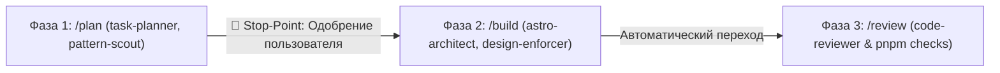

# Правило пайплайна разработки (Development Pipeline Rule)

Это правило определяет строгий регламент взаимодействия и жизненного цикла разработки компонентов и секций для данного проекта на Astro SSG.

---

## 🔄 Жизненный цикл задачи (3-фазный пайплайн)

Разработка любой фичи или секции строго разделяется на три изолированные фазы:

---

## 1. Фаза 1: Планирование (`/plan`, `/scout`)

- **Скиллы**: `task-planner`, `pattern-scout`.
- **Правило изоляции контекста**: В этой фазе **запрещено** создавать, изменять или генерировать рабочий код компонентов.
- **Обязанности**:
  - Сверить требования с [AGENTS.md](file:///c:/Users/Admin/WebstormProjects/portfolio/AGENTS.md) и [DESIGN.md](file:///c:/Users/Admin/WebstormProjects/portfolio/DESIGN.md).
  - Сформировать интерфейс пропсов (`interface Props`).
  - Описать семантическую структуру HTML5.
  - Детально расписать **Desktop-First** разметку и поведение на мобильных устройствах (адаптация сеток, отключение/упрощение сложных анимаций на touch-экранах, защита от CLS).
  - Если требуется нестандартный интерактив — вызвать `pattern-scout` для поиска Zero-JS решения.
- **Фиксация Stop-Point**:
  - Агент завершает ответ блоком `🛑 [STOP-POINT: ОЖИДАНИЕ ПОДТВЕРЖДЕНИЯ ПЛАНА]`.
  - Агент **обязан остановиться** и ждать подтверждения пользователя (`Приступай` / `/build` / корректировки).

---

## 2. Фаза 2: Реализация (`/build`, `/style`)

- **Скиллы**: `astro-architect`, `design-enforcer`.
- **Условие запуска**: Получено подтверждение плана от пользователя.
- **Обязанности**:
  - Реализовать компонент строго в нативном `.astro` (Zero JS by default).
  - Разместить компонент в правильной директории (`src/components/ui/` или `src/components/sections/`).
  - Если необходим остров — использовать жесткую матрицу (`client:visible` по умолчанию, `client:load` только для Hero).
  - Все изображения — только через `astro:assets` (`<Image />` или `<Picture />`) с `alt`, `width`, `height`.
  - Все классы, отступы, шрифты и цвета — строго из токенов `DESIGN.md`. Никаких «магических» чисел (`p-[17px]`).
  - Стилизация Desktop-First с обязательным медиа-запросом для отключения курсорных эффектов на тач-устройствах (`@media (hover: none)`) и поддержкой `prefers-reduced-motion`.

---

## 3. Фаза 3: Валидация и ревью (`/review`)

- **Скилл**: `code-reviewer`.
- **Автоматизация**: Запускается **сразу после завершения генерации компонента** без необходимости отдельного запроса пользователя.
- **Обязанности**:
  - Аудит качества: семантика (один `<h1>`, кнопки, ссылки), a11y, типизация.
  - Автоматический запуск проверок в терминале строго через `pnpm`:
    1. `pnpm run lint`
    2. `pnpm run fmt:check`
    3. `pnpm astro check`
  - Если выявлены ошибки — самостоятельно исправить их и повторить запуск до полного устранения дефектов.
  - Предоставить итоговый отчет валидации.
